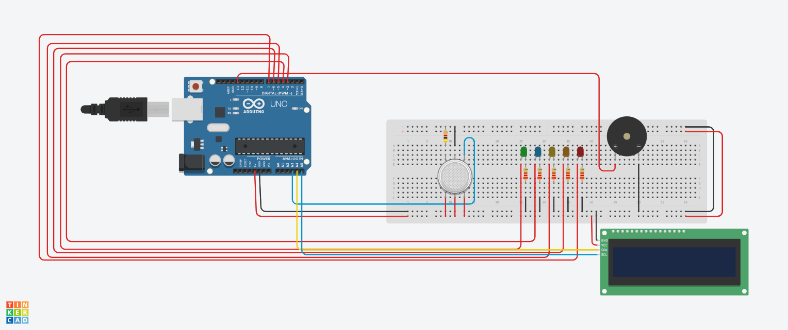

# 🌄 RFM Analysis


<div align="center">
  ✉️ Email: mail4tahsin@gmail.com <br>
  
  🔗 LinkedIn: [linkedin.com/in/tahsinayman](https://linkedin.com/in/tahsinayman) | 🐙 GitHub: [github.com/TahsinAyman](https://github.com/TahsinAyman)
  
</div>

---

- [Overview](#-overview)
- [Components Used](./components.xlsx)
- [Tools Used](#-tools-used)
- [Assemble Diagram](#assemble-diagram)
- [How to Run](#how-to-run)

## 🚀 Overview

This project aims to detect the presence and severity of a gas leak and provide timely alerts to the user through a 16x2 LCD display. The system utilizes a gas sensor to monitor the surrounding environment. Based on the sensor readings, it visually represents the gas concentration using a series of 5 LEDs that illuminate progressively as the leak intensifies. This LED indication is mirrored and enhanced by text-based warnings displayed on the LCD, providing clear and escalating alerts to the user.

## 💼 Tools Used


## Assemble Diagram


### How to Run 👈
- Clone the repository using 
    ```bash
    git clone https://github.com/TahsinAyman/gas_detector_alarming_system.git
    ```
- Assemble the hardware components as per the [schema diagram](./aseemble.png) provided in the repository.
- Use 4 kΩ on the Gas sensor and the rest on LEDs.
- Install the Adafruit LiquidCrystal library in the Arduino IDE.
- Open the Arduino IDE and load the code from the [file](./src/main.ino) provided on repository.
